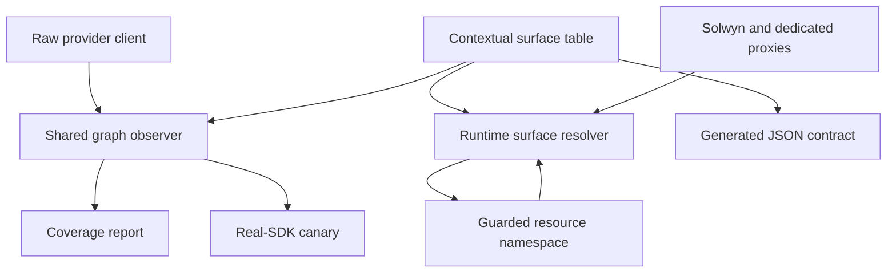
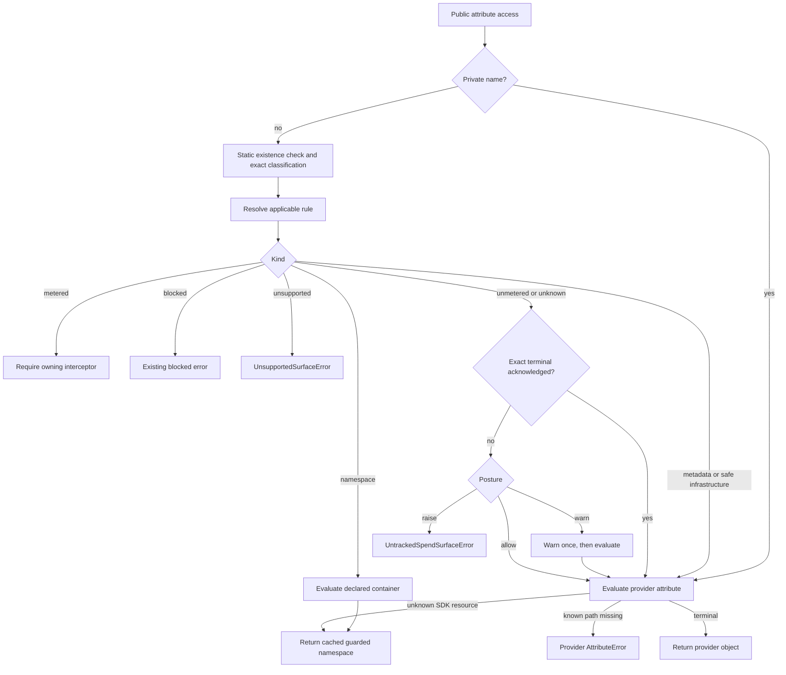

# Coverage Strict Mode and Coverage Manifest - Plan

## Goal Capsule

- **Objective:** Give every reachable public pre-call capability on supported wrapped client shapes an exact classification, guard untracked capabilities at runtime, and expose the effective result through a deterministic local coverage manifest.
- **Authority order:** The current SDK behavior and tests override this plan's examples. The classification contract overrides provider-wide assumptions. Exact client-shape rules override dialect defaults.
- **Execution profile:** Prove offline graph observability first. Then implement the table, posture control, and runtime guards together before widening warnings; add the manifest after runtime and canary behavior is stable.
- **Stop conditions:** Stop if implementation requires reading prompt or response content outside the privacy allowlist, importing provider SDKs in core code, or changing a Solwyn Cloud wire contract.
- **Trust boundary:** Strict mode is a cooperative guard on the wrapper's public surface. It is not a sandbox for code that retains the raw provider client or accesses private wrapper state.

---

## Product Contract

### Summary

Solwyn will maintain a closed-world pre-call capability graph for each supported provider client shape and Solwyn-owned proxy.
Known tracked leaves remain intercepted.
Known untracked leaves and unknown leaves warn, raise, or pass according to the configured posture.
Resource containers remain guarded so acknowledging or accessing a parent never silently authorizes its present or future descendants.
`solwyn.coverage(client)` will report the same graph and its effective policy and dispatch actions without network I/O or customer content access.
Provider-returned response, page, stream, job, and operation objects remain outside that graph unless a return value is itself a client or pre-call resource escape.

### Problem Frame

The current wrapper intercepts selected chat and media methods while many other provider attributes pass through.
The existing warn-once registry covers only a small subset of those capabilities.
Recent media and compatibility work also made dialect-only assumptions inaccurate: the wrapper exposes some methods that an adapter rejects, native Together has a different resource tree from an OpenAI client pointed at Together, and usage fallbacks now differ by surface.

The previous plan treated resource roots such as `responses` as billable leaves and treated raw-client factories and HTTP transport methods as harmless infrastructure.
That design lets strict mode return unguarded clients or resource objects.
It also lets a parent acknowledgment expand when a provider adds a new child method.

The primary adopter is a team that relies on Solwyn's budget controls while still using provider-specific SDK capabilities.
Today a call through an untracked leaf such as `responses.create`, a raw HTTP verb, or a client-returning helper can bypass Solwyn pre-flight and settlement without a machine-readable indication that it did so.
The intended user outcome is a compatibility-default warning mode, an opt-in fail-closed mode for pre-call bypasses, and deterministic local evidence of exactly which capabilities remain tracked, allowed, guarded, or refused.

The current implementation baseline is healthy: the unit suite, Ruff checks, formatting check, and Mypy pass before this work begins.
The relevant existing seams are `src/solwyn/_base.py`, `src/solwyn/client.py`, `src/solwyn/_proxies.py`, the provider adapters under `src/solwyn/providers/`, and the real-SDK detection tests under `tests/unit/`.

### Requirements

**Classification contract**

- R1. Every reachable public callable leaf and every resource container in the supported wrapped client's pre-call graph has an exact dotted-path classification.
- R2. Resource containers use `namespace`; acknowledgments apply only to terminal capability tokens and never authorize a namespace's descendants.
- R3. A surface absent from the applicable table classifies as `unknown`, and `unknown` follows the untracked posture.
- R4. Rule selection uses dialect, provider attribution, and client shape so native Together, OpenAI-compatible clients, and native OpenAI can differ while sharing a wire dialect.
- R5. Infrastructure classification uses exact full paths. No rule may classify an unseen nested capability from its terminal name, and no raw provider callable may be safe infrastructure; callable infrastructure must be wrapper-owned.
- R6. Rules distinguish `raw`, `wrapper`, `both`, and `synthetic_policy` sources. Runtime and manifest views include only rules applicable to the attached client, while the generated classification ledger exports the contextual rule set with its applicability metadata.
- R7. `unsupported` is distinct from deliberate `blocked` behavior even when both fail loud at runtime.
- R8. Usage basis is stored on each applicable metered rule. Coverage code must not infer or upgrade it from provider name.

**Runtime posture**

- R9. `on_unmetered` supports `warn`, `raise`, and `allow`, with `warn` as the compatibility default. In this plan, strict mode means `on_unmetered="raise"`; valid exact acknowledgments remain permitted. `SOLWYN_ON_UNMETERED` uses the same three literal values.
- R10. `acknowledge_untracked` contains exact, applicable, observed terminal tokens or exported conditional acknowledgment tokens. Namespaces, wildcards, typos, wrong-family rules, metered, blocked, and unsupported tokens are invalid. `SOLWYN_ACKNOWLEDGE_UNTRACKED` is comma-delimited: surrounding whitespace is trimmed, an empty value is an empty collection, and empty interior elements are invalid.
- R11. Access to a known or safely recognized unknown resource container returns a cached guarded resource object whose descendants re-enter the same classification and posture flow.
- R12. Raw-client factories, raw response wrappers, transport verbs, and equivalent capability-returning helpers are not safe infrastructure.
- R13. Strict mode resolves policy before evaluating an untracked or unknown provider descriptor and raises before returning or executing the capability.
- R14. Known missing provider paths preserve the provider SDK's `AttributeError`. A statically invisible dynamic name fails closed under strict mode with `UntrackedSpendSurfaceError`, which also subclasses `AttributeError` for feature probes.
- R15. Names beginning with `_` remain outside the public guard for Python runtime compatibility.
- R16. Sync and async wrappers resolve applicability before every explicit proxy dispatch and every client or proxy pass-through seam.
- R17. The token-billed TTS exception is a conditional policy entry for `audio.speech.create`, with a stable terminal acknowledgment token and visible manifest action.

**Coverage manifest**

- R18. `solwyn.coverage(client)` is module-level, deterministic, sans-I/O, and content-free.
- R19. Each manifest entry reports a stable rule ID, surface, token, kind, policy action, dispatch action, usage basis, source, capability scope, `expected_descriptor_category`, `observed_descriptor_category`, `expected_return_shape`, `observed_return_shape`, and optional condition. Here return shape means the value produced by safe attribute evaluation, never the result of invoking a provider operation.
- R20. Policy and dispatch are separate. Tracked entries report `track` and `intercept`; namespaces report `pass` and `guard`; metadata and safe infrastructure report `pass` and `return`; blocked and unsupported entries report their reason and `refuse`; untracked and unknown entries report their posture or acknowledgment plus `return`, `guard`, or `refuse` according to the observed descriptor category and return shape.
- R21. The manifest combines observed raw paths with applicable wrapper-owned and conditional-policy rows. It must not add every row from a shared dialect to every provider.
- R22. `CoverageReport.expect(...)` compares a literal audit fingerprint in both directions. The fingerprint covers untracked, unknown, escape, unsupported, policy-action, dispatch-action, descriptor-category, attribute-return-shape, and usage-basis changes and is never derived from the report under test.

**Maintenance and rollout**

- R23. One sans-I/O data module owns classification and JSON export data. The runtime guard, coverage manifest, committed human-reviewable classification ledger, and canary all consume it; the ledger is a current Python SDK audit artifact, not infrastructure justified only by a future TypeScript consumer.
- R24. Real-SDK canaries are mandatory for native OpenAI and Azure OpenAI, a representative generic compatible client, Anthropic, both `google-genai` and the still-supported `google.generativeai` shape, native Together, OpenAI configured for Together, sync boto3 Bedrock, and async aioboto3 Bedrock. CI exercises the supported dependency floor, every known public-resource-tree breakpoint, and the latest provider release through solver-compatible matrices.
- R25. The graph walker statically enumerates public roots and recurses through applicable table-declared namespaces without calling operations. Unknown roots fail the canary before arbitrary traversal.
- R26. Bedrock discovery uses the union of public client attributes and normalized service-model operation names.
- R27. The first behavior-changing change includes the posture knob, acknowledgment mechanism, strict error, and `allow` escape hatch. It must not rely on an unverifiable customer-count assumption.
- R28. Core code imports no provider SDKs and never captures, logs, stores, or transmits prompts or responses.

### Success Criteria

- Strict mode cannot yield an unguarded provider client or resource through a path classified as safe infrastructure.
- A strict adopter receives a deterministic refusal, before provider I/O, for every unacknowledged pre-call path that can bypass Solwyn interception.
- A parent token such as `responses` cannot authorize `responses.create` or a future sibling.
- Native OpenAI, an OpenAI-compatible client, and native Together produce different manifests when their reachable capabilities differ.
- Both supported Google client families and sync/async Bedrock coverage are exercised in required CI jobs instead of being skipped or represented only by fakes.
- The documented OpenAI coverage pin is a literal exhaustive audit fingerprint and fails when a relevant kind, policy action, dispatch action, descriptor category, attribute-return shape, usage basis, or surface changes in either direction.
- The generated JSON contract and Python table remain identical.
- Existing tracked chat and media behavior, privacy tests, and provider detection remain green.

### Acceptance Examples

- AE1. Given an OpenAI wrapper in strict mode, when code accesses `post`, `with_options`, or `copy`, then Solwyn refuses the unacknowledged capability before it can return a raw dispatch path.
- AE2. Given strict mode and an acknowledgment for `responses.create`, when code traverses `responses`, then Solwyn returns a guarded namespace and permits only the exact acknowledged leaf.
- AE3. Given strict mode and an acknowledgment for `responses`, when the client is constructed or the token is resolved, then Solwyn rejects the namespace acknowledgment as invalid.
- AE4. Given a native Together client, when coverage is generated for `videos.create`, then the entry is applicable and unsupported because the current compatibility adapter rejects the video seam.
- AE5. Given `gpt-4o-mini-tts`, when `audio.speech.create` is accessed under strict mode, then the conditional untracked policy raises unless `audio.speech.create:gpt-4o-mini-tts` is acknowledged.
- AE6. Given a new public method under a declared provider namespace, when the real-SDK canary runs, then it fails with the exact unknown dotted path.
- AE7. Given a literal expected coverage pin, when an untracked surface becomes tracked or a new untracked surface appears, then `expect(...)` reports the removal or addition.
- AE8. Given an untracked property descriptor with a side effect, when strict mode resolves it, then Solwyn refuses the path without evaluating the descriptor.
- AE9. Given a compatible provider whose wrapper exposes a non-applicable explicit method, when the method is called, then Solwyn raises `UnsupportedSurfaceError` before provider I/O and coverage reports `unsupported`.

### Scope Boundaries

**In scope**

- Local classification, runtime posture, namespace guarding, coverage reporting, CI canaries, generated JSON, and SDK documentation.
- Exact handling of provider capabilities exposed by the currently supported client families.
- A committed generated JSON ledger as the reviewable inventory of the Python SDK's classification table and the input to parity and documentation-contract checks.
- Removal of `_UNSHIPPED_SPEND_SURFACES` and `TogetherAdapter.unmetered_spend_surfaces` after the new contract is active.

**Deferred to follow-up work**

- Metering currently untracked operations such as Responses, parsing helpers, batch APIs, and native Together extras.
- Stripping `solwyn_tags` from untracked provider calls.
- Consuming or porting the generated classification ledger in the TypeScript SDK.
- Guarding methods on response, page, stream, job, and operation objects returned after a provider call, unless a return value is specifically identified as another client or pre-call resource escape.

**Outside this plan**

- Solwyn Cloud API, pricing, dashboard, or wire-contract changes.
- Converting the raw provider client into a security capability or hiding private Python attributes.
- Changing the existing Bedrock blocked-family exception type.

---

## Planning Contract

### Key Technical Decisions

- KTD1. **Use a contextual capability graph.** A rule is selected by exact path plus dialect, provider, and client shape. Client shape distinguishes at least `openai_sdk`, `native_together`, `anthropic_sdk`, `google_genai`, `google_generativeai`, `bedrock_boto3`, and `bedrock_aioboto3`, including sync or async mode when the graph differs. Detection remains duck-typed from module and class names. A query resolves to exactly one rule; zero means unknown and multiple matches are an invariant failure.
- KTD2. **Keep namespace guarding in the sans-I/O base.** `_SolwynBase` owns static existence inspection, classification, posture resolution, guarded-resource caching, and delayed descriptor evaluation. This preserves the repository's business-logic boundary and avoids a reverse import from `src/solwyn/_proxies.py` into `src/solwyn/_base.py`. Guards forward ordinary public attributes and safe inspection helpers only; callable, iterator, and context-manager special methods require synthetic classified leaves.
- KTD3. **Classify containers and leaves separately.** Resource roots such as `responses`, `completions`, `messages.batches`, and `videos` are namespaces. Operations such as `responses.create`, `messages.batches.create`, and `videos.create_and_poll` are terminal leaves.
- KTD4. **Make acknowledgments graph-aware and prefix-safe.** A token must resolve to an existing applicable leaf or conditional rule. Unknown leaves are eligible only when the attached live graph proves that exact path exists. Every prefix remains guarded until the terminal is reached, and validation runs even under `allow`.
- KTD5. **Treat provider escape hatches as scoped untracked capabilities.** Raw HTTP verbs, raw-client factories, raw-response resources, streaming-response resources, Google `aio`, middleware factories, and similar helpers require posture handling. Rules label the capability scope, such as `client`, `arbitrary_endpoint`, or `raw_response`. Exact acknowledgment intentionally accepts that documented scope and receives stronger error and help text than an ordinary leaf.
- KTD6. **Represent applicability, identity, source, and shape in data.** Every rule has a stable exported rule ID and token. Rules state which client shapes they apply to, whether the capability source is raw, wrapper, both, or synthetic policy, and their `expected_descriptor_category` and `expected_return_shape`. Specificity is deterministic and does not depend on table order.
- KTD7. **Resolve wrapper ownership before dispatch.** Explicit proxy methods consult applicability before provider I/O. Wrapper ownership takes precedence over an identically named raw path. `videos.create` is tracked for native OpenAI and reports `unsupported` for compatible adapters, including native Together, until their media dispatch implements video.
- KTD8. **Represent TTS as two rule identities.** The ordinary `audio.speech.create` rule is metered. The `gpt-4o-mini-tts` family adds a conditional untracked rule with a stable condition enum and token `audio.speech.create:gpt-4o-mini-tts`. Rule ID, not surface alone, uniquely keys acknowledgment and the manifest.
- KTD9. **Prove and share one graph observer before freezing the rule schema.** A permanent minimal `src/solwyn/_surface_graph.py` first proves that every mandatory real client shape can be observed offline without operation calls. Coverage and canaries then extend the same observer. It statically inspects public roots, evaluates only declared resource containers, recurses with cycle and depth protection, and combines observed paths with wrapper-owned and synthetic rows. An inaccessible declared container raises a typed inspection error with its exact path instead of being skipped.
- KTD10. **Export data, not files, from core.** `src/solwyn/_surfaces.py` returns JSON-ready contract data. A script under `scripts/` owns filesystem output and creates `docs/contracts/` before writing. The committed JSON is the exhaustive, human-reviewable Python classification ledger used by parity, fingerprint, and documentation-contract tests; future cross-SDK consumption is not required to justify it.
- KTD11. **Ship runtime control atomically with widened behavior.** The table, posture configuration, exception, guarded resolver, and all pass-through integrations land together. The manifest and documentation follow after that runtime contract is testable.
- KTD12. **Use total classification precedence and two-dimensional actions.** Deliberate block wins over unsupported, which wins over tracked wrapper ownership, conditional policy, raw classified leaf, and unknown posture. Acknowledgment affects only eligible untracked, unknown, or escape leaves. The manifest records the policy decision separately from whether dispatch is intercepted, returned, guarded, or refused.
- KTD13. **Report effective usage guarantees over reachable runtimes.** Rules store the basis for one runtime. Coverage combines only the runtimes that the leaf can actually reach, including chat failover candidates, and reports the conservative basis. Media paths remain primary-only unless their dispatch design changes.
- KTD14. **Guard the pre-call capability graph only.** Responses, pages, streams, jobs, and operation objects returned after provider I/O retain current behavior unless a return value is explicitly classified as another client or resource escape.
- KTD15. **Accept the closed-world support cost deliberately.** The compatibility-default posture needs exact safe metadata and infrastructure rows to avoid warning on harmless inspection, while strict audit needs provider drift to become an explicit review rather than a silent pass. The table therefore remains exhaustive for the supported pre-call graph. CI tests each known structural version interval, and a newly observed latest-SDK path blocks release until it receives a reviewed classification.

### Usage Basis Contract

| Surface | Applicability | Usage basis |
|---|---|---|
| `chat.completions.create` | Native OpenAI | `provider` |
| `chat.completions.create` | OpenAI-compatible and native Together | `provider_or_estimate` |
| `embeddings.create` | Native OpenAI and OpenAI-compatible clients | `provider_or_estimate` |
| `models.embed_content` | Google | `provider_or_estimate` |
| `images.generate`, `images.edit` | Native OpenAI and compatible clients | `provider_and_request` |
| `models.generate_images` | Google | `request_derived` |
| `audio.transcriptions.create` | Native OpenAI and compatible clients | `provider` |
| `audio.speech.create` | Applicable non-carved-out models | `request_derived` |
| `videos.create` | Native OpenAI | `request_derived` |
| `models.generate_videos` | Google | `request_derived` |
| Anthropic messages, Google content generation, Bedrock Converse | Their native client shapes | `provider` |

No provider-wide upgrade occurs in `src/solwyn/_coverage.py`.
Any future fallback changes the applicable rule and its tests in the same change as the runtime accumulator or media specification.
For a configured failover chain, coverage derives the effective basis from only the runtimes reachable by that leaf and reports `provider_or_estimate` when any reachable runtime may estimate.

### Audit Fingerprint Contract

The primary CI assertion uses a literal frozen expectation, not values copied from the report.
It contains sorted guarded namespaces, tracked leaves with usage basis, untracked leaves, unknown leaves, scoped escapes, blocked leaves, unsupported leaves, conditional rule tokens, and every metadata or infrastructure row's expected descriptor category and return shape.
`CoverageReport.expect(...)` compares each category in both directions and reports the category and rule ID for every addition, removal, or changed policy action, dispatch action, expected or observed descriptor category, expected or observed return shape, or usage basis.
Metadata and safe infrastructure are pinned because a provider can repurpose a previously harmless exact path into a callable or capability-returning object.
The README OpenAI example uses the exact same literal expectation exercised by the real-client test.

### Mandatory Current-State Audit Cases

The committed classification ledger is the exhaustive row inventory; this plan defines its decision policy and mandatory cases without duplicating every generated row.
The initial audit must classify these current cases before the contract is accepted:

- OpenAI resource containers including `responses`, `completions`, `batches`, `beta`, `files`, `chat`, `audio`, `videos`, and `evals`, followed by their exact public leaves.
- OpenAI video helpers including `create_and_poll`, `create_character`, `edit`, `extend`, `get_character`, `poll`, and `remix`.
- Raw capability paths including root transport verbs, `with_options`, `copy`, and nested raw/streaming response resources.
- Capability-returning helpers such as Google `aio` and any `with_middleware` path, with explicit capability scope.
- Anthropic `messages.stream`, `messages.parse`, `messages.batches.create`, and equivalent raw response resources.
- Native Together paths such as `rerank.create`, `code_interpreter.execute`, `evals.create`, and `videos.create`, without assuming the OpenAI SDK resource tree.
- `google-genai` synchronous resources and the client returned by `aio`, plus the distinct root methods and resources exposed by a real `google.generativeai` client.
- Sync boto3 and async aioboto3 Bedrock public plumbing plus the service-model operations, including `invoke_guardrail_checks` when present. A service-model-only operation is classified but is not reported as reachable unless the attached client or wrapper exposes it.

### Initial Classification Policy and Review Gate

U0 produces the raw, versioned inventories; U1 must convert every observed pre-call row into the committed classification ledger before runtime behavior changes.
The canary discovers paths and shapes but never chooses policy.
Review applies this precedence to each exact contextual row:

| Observed or wrapper-owned case | Initial kind | Policy and dispatch |
|---|---|---|
| Existing Solwyn interceptor for an applicable client shape | `metered` | `track` + `intercept` with explicit usage basis |
| Solwyn-owned method that the selected adapter cannot serve | `unsupported` | `unsupported` + `refuse` before provider I/O |
| Existing deliberate provider-family block | `blocked` | `block` + `refuse` with the existing exception contract |
| Traversable pre-call resource container | `namespace` | `pass` + `guard`; never acknowledgment-eligible |
| Exact scalar or inert inspection value with reviewed `expected_descriptor_category` and `expected_return_shape` | `metadata` | `pass` + `return`; any shape drift re-enters unknown posture |
| Wrapper-owned callable helper, or exact inert noncallable helper, proven not to expose a client, resource, raw response, transport, or provider dispatch | `infrastructure` | `pass` + `return`; any shape drift re-enters unknown posture |
| Raw transport, raw/stream response helper, client/resource factory, or opaque capability-bearing object | `unmetered_spend` with capability scope | Posture-controlled + `return`, `guard`, or `refuse` |
| Any other observed public callable terminal | `unmetered_spend` | Posture-controlled + `return` or `refuse` |
| Any runtime path absent from the reviewed ledger | `unknown` with synthetic identity | Posture-controlled + `return`, `guard`, or `refuse` |

The safe `metadata` and `infrastructure` rows are exact allowlists, not name heuristics.
Every raw provider callable that is not metered, blocked, or unsupported is posture-controlled even when its current name sounds administrative.
Every such row records `expected_descriptor_category` and `expected_return_shape`.
At runtime, a static-shape mismatch is classified as unknown before descriptor evaluation where possible; a return-shape mismatch after evaluation is treated as unknown or as a scoped escape and immediately follows the configured posture.

Unknown entries use the deterministic synthetic rule ID `unknown:{client_shape}:{mode}:{provider}:{path}` and the exact dotted path as their token.
They report `source=raw`, no usage basis, both observed shape fields, and a capability scope when one can be established without content access.
Separating policy action from dispatch action lets an unknown resource report, for example, `warn` + `guard`, rather than losing one of those facts in a single action field.

### High-Level Technical Design

If the generic resolver encounters a `metered` leaf that is not owned by a dedicated interceptor, it raises an internal runtime invariant error instead of returning the raw method.
That condition means the table and proxy wiring disagree.

When warn or allow permits an unknown attribute that resolves to a non-scalar object from the detected SDK family, the resolver returns a guard and continues path-qualified classification.
If the object cannot be safely recognized or guarded, the rule is reported as an opaque escape with its capability scope; strict mode refuses it, while warn or allow may return it with that limitation visible in coverage.
Unknown containers are never valid acknowledgment targets.
Warn-once state is keyed by provider, client shape, and rule ID so one provider cannot suppress another provider's warning for the same surface text.

### Delivery Sequence

1. **Evidence prerequisite (U0):** prove offline static observability and capture raw inventories for every mandatory real-client shape and every known structural version interval.
2. **Runtime contract change (U1-U3):** contextual exact table and committed classification ledger, posture configuration, exceptions, guarded namespaces, TTS policy, every sync/async call site, and removal of old registries.
3. **Audit and manifest change (U4-U6):** required drift canaries, public coverage models, literal audit fingerprints, and documentation.

The first change contains both the new warnings and their `allow` control.
No release step relies on a claim about current customer count.

### System-Wide Impact

- **Public SDK configuration:** adds `on_unmetered` and `acknowledge_untracked`, `SOLWYN_ON_UNMETERED`, and comma-delimited `SOLWYN_ACKNOWLEDGE_UNTRACKED` with the parsing rules in R10.
- **Public SDK exports:** adds coverage models, coverage function, and typed errors.
- **Provider adapters:** classification uses adapter name and raw client shape but does not add provider SDK imports.
- **Privacy:** graph observation reads attribute names and resource objects only. It never inspects request arguments, prompts, or responses.
- **Generated classification ledger:** the JSON schema carries stable rule IDs, contextual applicability, source, expected descriptor category, expected attribute-return shape, capability scope, condition enums, and contract-version fields. It is reviewed and tested in this SDK now; a future TypeScript consumer must negotiate its version separately.
- **Server:** no request, response, enum, or pricing contract changes; the API repository is not part of this implementation.

### Risks and Mitigations

| Risk | Mitigation |
|---|---|
| Guarded namespaces change object identity for resource containers | Limit guarding to containers; keep safe terminal leaves and explicitly allowed capabilities as provider-owned objects. Add identity tests for safe leaves and behavior tests for guarded containers. |
| A guard misses dispatch through `__call__`, iteration, or a context manager | Do not generically forward dispatch-capable special methods. Add a synthetic exact rule before supporting any such protocol. Cache ordinary guards per wrapper and path. |
| A raw-client escape hatch is misclassified as infrastructure | Use exact full-path rules and mandatory tests for client factories, transport verbs, response wrappers, and Google `aio`. |
| Static inspection and provider descriptors disagree | Decide posture from `dir()` and `inspect.getattr_static` before descriptor evaluation. Treat invisible dynamic names as unknown and fail closed under strict mode. |
| A provider repurposes a pass-classified path into a dispatch or client-returning capability | Store expected and observed descriptor categories and attribute-return shapes on every metadata/infrastructure row. Treat mismatches as unknown or scoped escapes and pin all four fields in canaries and audit fingerprints. |
| `AttributeError` subclassing hides a strict refusal inside broad exception handling | Preserve the deliberate feature-probe behavior and make the manifest's effective `raise` action the CI-auditable signal. Document the tradeoff. |
| Provider SDK recursion loops or evaluates unsafe descriptors | Recurse only through declared namespaces, track object identities, and fail with the exact path when a declared namespace cannot be observed offline. |
| Provider-version drift produces false positives for new metadata | Keep `warn` as the default. Strict adopters can add a reviewed exact terminal acknowledgment while waiting for a table update. |
| Floor/latest checks miss a non-monotonic intermediate resource tree | U0 records public-graph breakpoints and CI pins one release from every supported structural interval, plus latest. New breakpoints update the matrix and ledger together. |
| Closed-world maintenance delays provider upgrades | Treat classification drift as an explicit compatibility decision, keep the graph limited to pre-call capabilities, and document the tested version intervals. Do not silently expand the pass allowlist. |
| An acknowledgment accidentally authorizes a whole resource | Reject namespaces and keep prefixes guarded. Tests must add a future sibling after an acknowledged leaf and prove it remains refused. |
| The manifest invents capabilities from a shared dialect | Filter every rule by client shape and origin. Include only observed raw paths plus applicable wrapper/policy rows. |
| Google silently loses coverage | Install `google-genai` in the dev extra and import it directly in the standard canary. |
| Legacy Google or async Bedrock silently loses coverage | Install `google-generativeai` and aioboto3 in controlled canary environments and exercise their genuine client shapes without `importorskip`. Resolve boto3/aiobotocore pins as a compatible set. |
| Importing latest third-party SDKs expands CI supply-chain exposure | Give canary jobs `contents: read`, disable persisted checkout credentials, provide no provider/cloud credentials, and retain socket denial around client construction and traversal. |
| Documentation and tests drift | Use a literal audit fingerprint and verify the README example against the tested OpenAI fingerprint. |

---

## Implementation Units

### U0. Offline observer and provider-shape inventory

- **Goal:** Prove the graph-observation premise against every supported real SDK shape before the rule schema or runtime resolver becomes load-bearing.
- **Requirements:** R24-R26, R28; KTD9, KTD15.
- **Dependencies:** None.
- **Files:** Create `src/solwyn/_surface_graph.py`, `tests/unit/test_surface_observer.py`, `scripts/capture_surface_inventory.py`, and version-labelled fixtures under `tests/fixtures/provider_surface_inventory/`; modify `pyproject.toml`, `uv.lock`, `Makefile`, and `.github/workflows/ci.yml`.
- **Approach:** Implement the minimal provider-agnostic observer needed to enumerate public roots, inspect descriptor categories statically, and traverse an explicit test-supplied namespace set with cycle and depth protection. Add `google-genai`, `google-generativeai`, boto3, aioboto3, OpenAI, Anthropic, and Together to controlled dev/canary dependency sets without importing them from `src/`. Construct genuine sync and async clients with fake credentials and disable socket access. Run an observer-only solver-compatible matrix at the supported floor, every known public-resource-tree breakpoint, and latest; persist a deterministic raw inventory fixture for every client-shape/interval pair. Boto3 and aiobotocore versions are resolved as compatible sets rather than independently pinned. U0's matrix jobs use read-only repository permissions, no persisted checkout credentials, and no provider/cloud credentials. U1 consumes these fixtures, while U4 reuses the same matrix with classification enforcement enabled.
- **Test scenarios:**
  - Native OpenAI/AsyncOpenAI, Azure/AsyncAzureOpenAI, Anthropic/AsyncAnthropic, native Together/AsyncTogether, and generic compatible clients yield deterministic public roots offline.
  - Real `google-genai` sync resources and `aio` are observable, and a real `google.generativeai` client records its distinct root shape.
  - Real boto3 and aioboto3 `bedrock-runtime` clients expose their actual public attributes without making an AWS request.
  - Declared namespace traversal detects cycles, repeated objects, inaccessible descriptors, and depth exhaustion with the exact dotted path.
  - Observation records descriptor category and returned capability shape without inspecting request arguments, prompts, responses, or credentials.
  - A temporary new child under a declared namespace appears in the raw inventory without being assigned a policy automatically.
  - Every persisted fixture records distribution name, installed version, structural interval, client shape, mode, exact path, observed descriptor category, and observed return shape in deterministic order.
- **Verification:** The observer-only structural-interval matrix and committed fixtures pass before U1. Every mandatory client shape is statically observable enough to support the proposed guard, or implementation stops here and revises the architecture.

### U1. Contextual surface contract

- **Goal:** Create the exact capability data model and replace dialect-wide and terminal-name assumptions.
- **Requirements:** R1-R8, R23, R28; KTD1, KTD3, KTD5-KTD8, KTD10, KTD15.
- **Dependencies:** U0.
- **Files:** Create `src/solwyn/_surfaces.py`, `tests/unit/test_surfaces.py`, `scripts/export_surface_contract.py`, and `docs/contracts/surface-classification.json`.
- **Approach:** Apply the Initial Classification Policy to every persisted U0 inventory row and check in the resulting exhaustive contextual ledger before runtime behavior changes. Define kinds including `namespace`, `metered`, `blocked`, `unsupported`, `unmetered_spend`, `metadata`, `infrastructure`, and `unknown`. Add stable rule ID, contextual applicability, usage basis, source, capability scope, condition enum, acknowledgment token, `expected_descriptor_category`, and `expected_return_shape`. Resolve rules by exact path and deterministic specificity. Keep the module content-free and sans-I/O; the export script owns filesystem creation and deterministic newline-terminated JSON.
- **Patterns to follow:** Frozen data rows such as `CompatProfile` in `src/solwyn/providers/openai_compatible.py`; provider name versus dialect separation in `src/solwyn/providers/_protocol.py`; Pydantic v2 and runtime-invariant rules from `AGENTS.md`.
- **Test scenarios:**
  - Native OpenAI and an OpenAI-compatible client select different rules for the same video path.
  - Native Together selects its client-shape rules instead of inheriting the OpenAI SDK resource tree.
  - A safe infrastructure path matches only at its exact depth; a new nested `delete` remains unknown.
  - No raw provider callable can classify as safe infrastructure; wrapper-owned lifecycle helpers remain eligible.
  - `responses` classifies as a namespace and `responses.create` as a terminal untracked capability.
  - Every metered rule has an explicit usage basis and non-metered rules do not acquire one implicitly.
  - The ordinary and conditional TTS rules coexist with distinct stable tokens.
  - Every provider, client-shape, mode, and path query resolves to zero or one rule; ambiguous matches fail an invariant.
  - No namespace is acknowledgment-eligible and no escape rule lacks capability scope.
  - Every U0-observed path at each supported structural version interval has a reviewed ledger row; the canary, not a name heuristic, identifies any omission.
  - Metadata and infrastructure rows have explicit expected descriptor categories and expected attribute-return shapes.
  - JSON-ready export order and contract version are deterministic, the script creates `docs/contracts/`, and the committed ledger matches the Python data.
- **Verification:** The classification tests prove exact-path, client-shape, origin, condition, shape, and usage-basis behavior without importing provider SDKs into core code.

### U2. Posture configuration and guarded resolver

- **Goal:** Enforce exact-path posture decisions without returning unguarded namespaces.
- **Requirements:** R9-R15, R27-R28; KTD2-KTD5, KTD11-KTD12; covers AE1-AE3 and AE8.
- **Dependencies:** U1.
- **Files:** Modify `src/solwyn/config.py`, `src/solwyn/exceptions.py`, `src/solwyn/_base.py`, and `src/solwyn/__init__.py`; create `tests/unit/test_unmetered_posture.py`; extend `tests/unit/test_config.py`, `tests/unit/test_exception_hierarchy.py`, and `tests/unit/test_public_exports.py`.
- **Approach:** Add the posture and acknowledgment configuration. Parse `SOLWYN_ON_UNMETERED` as the posture literal and `SOLWYN_ACKNOWLEDGE_UNTRACKED` as the comma-delimited exact-token collection defined in R10, while constructor arguments remain authoritative. Centralize static existence inspection, exact classification, pre-descriptor posture resolution, delayed attribute evaluation, contextual warn-once behavior, graph-aware acknowledgment validation, shape-drift handling, and cached guarded namespaces in `_SolwynBase`. Validate each token against the applicable live graph or synthetic rule even under `allow`.
- **Test scenarios:**
  - Default warn logs once and returns a terminal untracked leaf.
  - Allow is silent and preserves the terminal provider object.
  - Raise refuses known untracked and unknown terminal leaves.
  - A known missing provider path raises the provider's `AttributeError`; a statically invisible dynamic unknown fails closed under strict mode.
  - `hasattr` and `getattr(..., default)` treat a strict refusal as absent.
  - Namespace, wildcard, typo, wrong-family, metered, blocked, and unsupported acknowledgments fail validation.
  - Environment acknowledgments trim surrounding whitespace, accept an empty value as empty, reject empty interior elements, deduplicate exact repeats, and are overridden by an explicit constructor value.
  - A longer unknown acknowledgment keeps every prefix guarded and permits only the exact terminal.
  - A future sibling beside an acknowledged leaf remains refused.
  - Raw client factories and transport verbs are refused under raise and expose their capability scope in the error.
  - An untracked property descriptor is not evaluated before strict refusal; a pass-classified descriptor or return-shape mismatch re-enters unknown or escape posture.
  - Repeated namespace access returns the same wrapper-level guard object.
  - An allowed unknown SDK resource remains guarded; an opaque unguardable object is visible as an escape.
  - Dispatch-capable special methods are not forwarded without a synthetic rule.
  - Private names preserve the existing raw pass-through behavior.
- **Verification:** The resolver has no provider imports or content access, and posture tests pass for both wrapper classes where behavior is shared.

### U3. Complete sync and async capability integration

- **Goal:** Route every current public pass-through seam through the guarded resolver and represent conditional or unsupported wrapper behavior accurately.
- **Requirements:** R11-R17, R27-R28; KTD2, KTD7-KTD8, KTD12-KTD14; covers AE5 and the runtime portion of AE9.
- **Dependencies:** U1, U2.
- **Files:** Modify `src/solwyn/client.py`, `src/solwyn/_proxies.py`, `src/solwyn/providers/together.py`, and `src/solwyn/_base.py`; extend `tests/unit/test_provider_proxies.py`, `tests/unit/test_audio_speech.py`, `tests/unit/test_audio_transcriptions.py`, `tests/unit/test_client.py`, and `tests/unit/test_together_client.py`.
- **Approach:** Resolve applicability before every explicit proxy method and every pass-through. Cover `Solwyn.__getattr__`, `AsyncSolwyn.__getattr__`, raw-returning `messages` and `models` branches, and every sync/async proxy `__getattr__`. Include chat, chat completions, embeddings, images, audio, transcriptions, speech, videos, Anthropic messages, Google models, and both translations properties. Replace the TTS-specific warning path with the shared conditional rule. Remove both legacy registries only after all call sites use the resolver.
- **Test scenarios:**
  - A table-driven test exercises every listed sync and async pass-through accessor and verifies the exact dotted token.
  - A table-driven applicability matrix exercises every explicit proxy method before dispatch.
  - `_SyncChatProxy.__getattr__` and `_AsyncChatProxy.__getattr__` refuse a novel chat-level leaf in strict mode.
  - Raw and streaming response resource chains remain guarded until their terminal methods.
  - A metered leaf reaching the generic resolver raises the internal wiring invariant instead of passing through.
  - Native Together video and every other non-applicable explicit proxy method raise `UnsupportedSurfaceError` before provider I/O, while native OpenAI video remains tracked.
  - Conditional TTS warns, raises, or allows through the shared policy in both sync and async clients.
  - Existing tracked chat, embeddings, images, audio, and video calls keep their interception and settlement behavior.
  - Returned provider responses, pages, streams, jobs, and operations retain their current post-call behavior.
- **Verification:** No public proxy pass-through returns a known namespace raw, and searches find no remaining legacy unmetered registry or TTS-only warning helper.

### U4. Mandatory provider graph drift canary

- **Goal:** Make current and future provider SDK drift a required CI decision.
- **Requirements:** R23-R26, R28; KTD1, KTD6, KTD9-KTD10, KTD15; covers AE6.
- **Dependencies:** U0, U1, U3.
- **Files:** Create `tests/unit/test_surface_canary.py`; extend `src/solwyn/_surface_graph.py`; modify `Makefile` and `.github/workflows/ci.yml`; reuse client-construction patterns from `tests/unit/test_real_sdk_detection.py`.
- **Approach:** Import required provider SDKs directly in the canary. Extend the U0 observer to join observed paths with the contextual ledger and recurse only through table-declared namespaces. Cover every supported sync and async client shape. Run a solver-compatible provider matrix containing the supported floor, one pin from every known public-resource-tree interval, and latest. Inspect the union of Bedrock public attributes and service-model operations. Deny socket access during construction and traversal. Give canary jobs read-only repository permissions, disable persisted checkout credentials, and provide no provider or cloud credentials.
- **Test scenarios:**
  - OpenAI, AsyncOpenAI, AzureOpenAI, and AsyncAzureOpenAI have no ambiguous or unknown public paths after declared-namespace traversal.
  - A representative generic compatible client and OpenAI configured for Together exercise compatibility applicability without vendor SDK imports.
  - Anthropic and AsyncAnthropic classify messages, batches, raw response resources, and new leaves exactly.
  - Native Together and AsyncTogether differ from OpenAI clients configured for Together where their resource trees differ.
  - `google-genai` sync resources and `aio`, plus a real `google.generativeai` client, are classified and fail rather than skip when their dependencies are unavailable.
  - Bedrock combines `dir(client)` with normalized service operations, records actual exposure, and never invents a callable from a service-model-only operation.
  - Real aioboto3 Bedrock is exercised alongside boto3 with a solver-compatible boto3/botocore/aiobotocore set; existing fake-client behavior remains covered.
  - An added public child under a declared namespace produces a failure containing client family, installed version, and full dotted path.
  - A cycle, repeated resource object, or declared namespace inspection failure terminates deterministically and reports the path.
  - Table invariants reject duplicate rule IDs, ambiguous applicability, acknowledgment-eligible containers, and terminal-name heuristics.
  - Floor, each known structural breakpoint, and latest supported SDK versions accept a table superset while reporting raw-only rows only when present.
  - Socket denial proves the canary is offline.
  - The parsed committed JSON equals the versioned in-memory export and ends with a newline.
- **Verification:** Required canaries do not use `importorskip`; CI runs every supported structural version interval and latest; the committed classification ledger comparison passes.

### U5. Coverage manifest and literal audit fingerprints

- **Goal:** Expose the attached client's effective guarded capability graph for local audit and CI.
- **Requirements:** R18-R22, R25-R26, R28; KTD6-KTD9, KTD12-KTD14; covers AE4, AE7, and the coverage portion of AE9.
- **Dependencies:** U1, U3, U4.
- **Files:** Create `src/solwyn/_coverage.py` and `tests/unit/test_coverage_manifest.py`; modify `src/solwyn/exceptions.py` and `src/solwyn/__init__.py`.
- **Approach:** Build frozen Pydantic v2 report models from the shared observer. Include provider, dialect, client shape, posture, reachable provider chain, sorted acknowledgments, and sorted entries. Each entry carries rule ID, token, source, capability scope, condition, policy action, dispatch action, `expected_descriptor_category`, `observed_descriptor_category`, `expected_return_shape`, and `observed_return_shape`. Combine observed raw paths with applicable wrapper-owned and synthetic rows. Apply total classification precedence and aggregate usage basis only over runtimes reachable by that leaf. Synthesize unknown IDs using the contract above. Use literal audit fingerprints per real client shape.
- **Test scenarios:**
  - Namespace, metered, blocked, unsupported, metadata, infrastructure, untracked, and unknown entries report distinct correct policy and dispatch actions.
  - Native OpenAI, a compatible OpenAI client, and native Together include only applicable entries and correct usage bases.
  - Compatible transcription remains provider-derived while embeddings and Google embeddings report provider-or-estimate.
  - Native OpenAI chat with a compatible failover reports the conservative provider-or-estimate basis; media entries ignore unreachable failover runtimes.
  - Conditional TTS appears as a distinct token with its condition and current policy and dispatch actions.
  - Wrapper-owned unsupported video appears even when absent from the raw client.
  - Absent raw-only rows are omitted, while applicable wrapper and synthetic rows remain visible with their source.
  - A novel raw leaf appears in `unknown` with a deterministic synthetic ID and is sorted deterministically.
  - An allowed or warned unknown resource reports both its posture action and guarded dispatch; a strict unknown reports refusal.
  - Metadata or infrastructure descriptor-category or return-shape drift changes the fingerprint and follows unknown or scoped-escape posture.
  - An inaccessible declared namespace raises a typed inspection error containing the exact path.
  - Sync and async reports are identical for equivalent client shapes.
  - `expect(...)` fails for surface, kind, policy action, dispatch action, all four shape fields, escape scope, unsupported, and usage-basis changes in either direction and passes only against a literal fingerprint.
  - Passing a non-Solwyn object raises `TypeError` without importing `src/solwyn/client.py` into the coverage module.
- **Verification:** The report is deterministic, local, content-free, cycle-free, and exact-pin tests are non-tautological.

### U6. Documentation, rollout, and contract ownership

- **Goal:** Publish an executable strict-mode and coverage contract without overstating the security boundary or provider support.
- **Requirements:** R18, R22-R28; KTD10-KTD11, KTD14.
- **Dependencies:** U4, U5.
- **Files:** Modify `README.md`, `CHANGELOG.md`, and `src/solwyn/CLAUDE.md`; extend `tests/unit/test_coverage_manifest.py` or add a focused documentation contract test.
- **Approach:** Document all three postures, exact leaf acknowledgments, both environment encodings, guarded namespaces, conditional TTS token, literal OpenAI audit fingerprint, locally computed coverage, and the cooperative trust boundary. Explain that retaining the raw client, using private wrapper state, explicitly acknowledging a scoped raw escape, or invoking native behavior on a returned response/page/stream/job/operation object bypasses pre-call strict enforcement. Describe the generated JSON as this SDK's current reviewable classification ledger; future downstream consumption remains deferred.
- **Test scenarios:**
  - The README OpenAI example uses the same exhaustive literal audit fingerprint as the real-client test.
  - The example never feeds any report-derived value back into `expect(...)`.
  - Documentation names the exact conditional TTS token and states that namespace tokens are invalid.
  - Documentation distinguishes unsupported compatible video from tracked native OpenAI video.
  - Documentation states that strict mode is not a sandbox, that post-call provider objects may perform native provider I/O outside the guard, and that coverage transmits nothing.
- **Verification:** Every added README claim is exercised by a test or linked to an exported type, and the changelog describes the behavior change and escape controls in the same release entry.

---

## Verification Contract

| Gate | Applies to | Required result |
|---|---|---|
| Targeted observer, surface, posture, canary, and coverage unit tests | U0-U6 | All scenarios pass for sync and async paths where applicable. |
| `make test` | Entire plan | Unit suite passes with no unexpected skips; both Google families and sync/async Bedrock canaries execute. |
| `make check` | Entire plan | Ruff lint, Ruff format check, and Mypy pass. |
| Privacy firewall and no-production-assert tests | U0-U5 | New modules remain outside content access and use runtime exceptions for invariants. |
| Generated classification-ledger comparison | U1, U4, U5 | Committed JSON equals the versioned Python export. |
| Provider structural-interval matrices | U0, U4-U6 | Required provider SDK imports and real-client canaries pass at the supported floor, each known graph breakpoint, and latest. |
| Offline canary guard | U0, U4 | Client construction and graph traversal attempt no socket access. |

Integration tests against Solwyn Cloud are not required because this plan changes no wire or server behavior.
If implementation adds a wire field or enum despite that boundary, stop and validate the API repository before continuing.

---

## Definition of Done

- U0 is done when every mandatory real SDK shape is observably enumerable offline, supported structural version intervals are recorded, and the architecture has not assumed a resource graph that any supported client cannot expose safely.
- U1 is done when exact contextual rules replace terminal-name and dialect-only classification, every U0-observed row has a reviewed classification and shape contract, the committed ledger matches, and usage basis and conditional policy data are explicit.
- U2 is done when strict mode resolves policy before descriptor evaluation, blocks unacknowledged terminal capabilities, and keeps namespace traversal guarded.
- U3 is done when every explicit sync/async dispatch and pass-through seam uses applicability resolution and old registries and warning-only carve-outs are gone.
- U4 is done when every supported real SDK shape runs at its floor, each known structural breakpoint, and latest in least-privilege CI, and the observer finds no ambiguous, unknown, or shape-drifted current paths.
- U5 is done when the manifest reports only reachable or applicable capabilities and literal fingerprints detect every audit-relevant change in both directions.
- U6 is done when documentation, changelog, classification-ledger ownership, and the cooperative trust boundary are accurate and tested.
- The full unit and static quality gates pass from a clean implementation state.
- No abandoned experimental proxy, duplicate registry, provider-specific heuristic, or stale plan-era compatibility path remains in the implementation diff.
